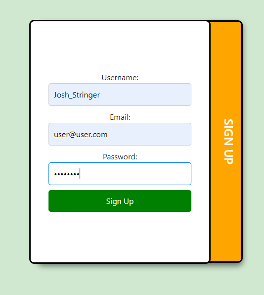
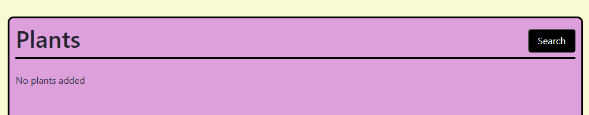
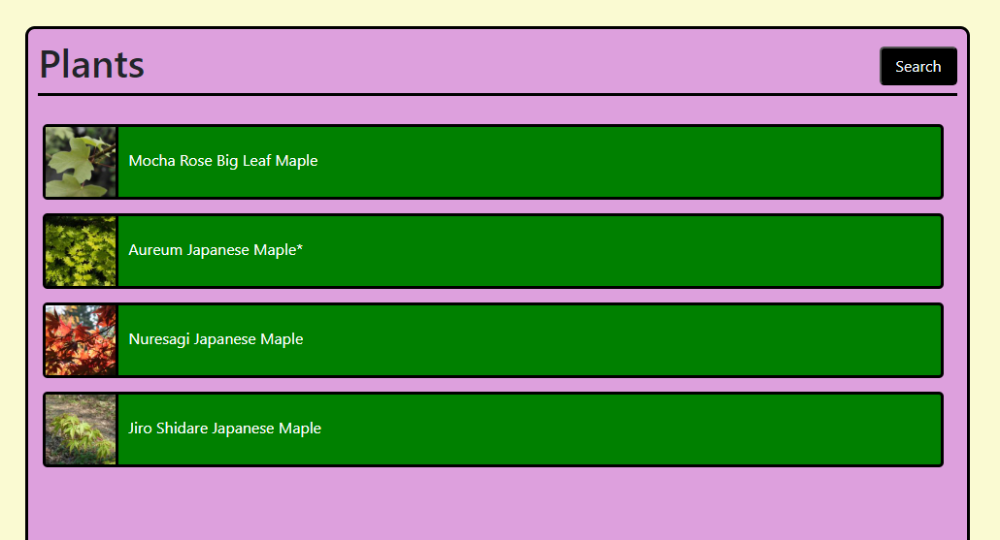

# Project-3-Solo

## TABLE OF CONTENTS

1. Description
2. Installation
3. Usage
4. Credits
5. License
6. Render Link

## Description:

This repo showcases a site that allows you to sign up, login in, search for plant information from Perenual API, and then save that information to a profile for quick reference.

## Installation:

To install, you'll run npm i from your main package.json, then run npm run install to install all other dependencies. Should have been all one command but hey, sometimes time just isn't on your side.

## Usage:

Use "npm run develop" and you'll be brought to the home page. 
  
Next, sign up using the signup box 
  
or if you are crazy and have been here before, login with the login box. 
  
Next you'll be brought to an empty profile page. 
  
Then click the search button on the Plant box to begin. 
  
You'll be brought to the search page where the real action begins. 
  
Type the name of any plant you can think of and the API will show you a list of plants! Wow! 
  
Click on a plant and it will show you it's info, plus you can click the add button to send it to your profile. 
  
Use the profile button to go back to your profile and you'll see your plants there now! Woah! 
  
Click on a plant here and you'll get to see the detailed info again, but now you have all your plants in one place. 
  
Finally, click logout when you are done and you'll be sent right back to the home screen, completing this long and arduous journey. 
  

## Credits:

Josh Stringer

## License:

Refer to the LICENSE in the repo.

## Render Link:

https://project-3-solo.onrender.com/

## Notes For Jung:

Making one of these alone is pretty hard I found out, especially when you are also doing another project with a team and time is just not there. Wanted to go over a few things that I tried but didn't quite come together.

1. Had a cool leaf logo on the page title but it just wouldn't work on Render. It worked on the page tab, so who knows?
2. Every deployment test, every screen change, css just went crazy. Hopefully by the time you are seeing this, I've at least fixed the home screen for my big monitor (laptop screens beware), put I have an hour so probably not gonna happen.
3. Password has to exist on signup and login, but that's about it. Never got around to bcrypt or even just checking what you type against what is on the database. Bummer, but it is what it is.
4. Colors are crazy, haven't found my style yet so I just threw everything against the wall.
5. Had a full on delete function for removing plants from the User, working beautifully until it got on Render. It would delete from the live database, but on relogin, it would just show up again. It's like a ghost and I didn't have an exorcist handy. Had to remove it in the end, but hey, you'll still see it in the group 1 project because the code freeze got me.

6. Great experience, 10/10, will do again, probably starting the day after class ends. Thanks for teaching me.
